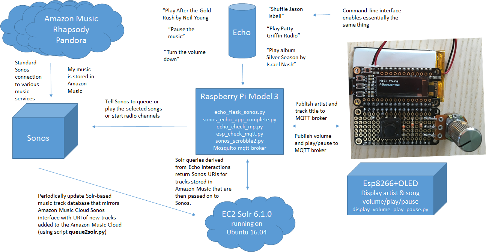

# Home for some semi-permanent documentation so I can remember what I did

Will cover:

- listmanger
- echo sonos
- display info

[Github Pages](pages.github.com/) 

[queue2solr.py](/queue2solr) 

[Info Display](/info_display) 

The design of Echo Sonos: 

